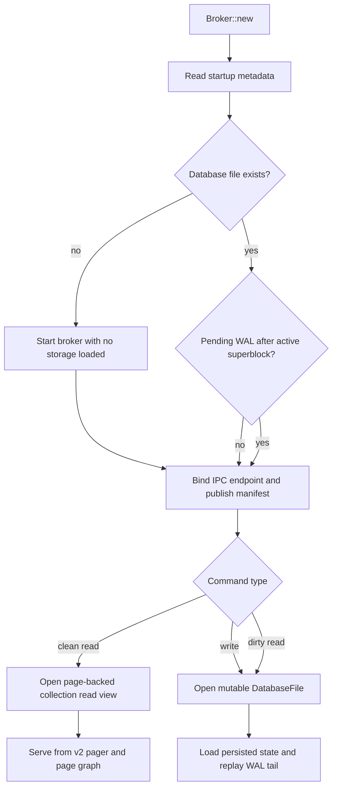
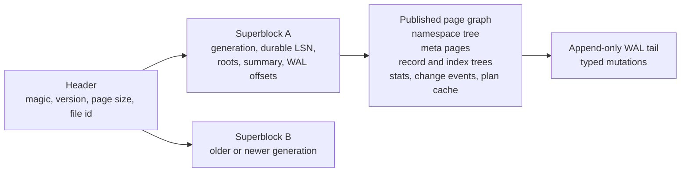
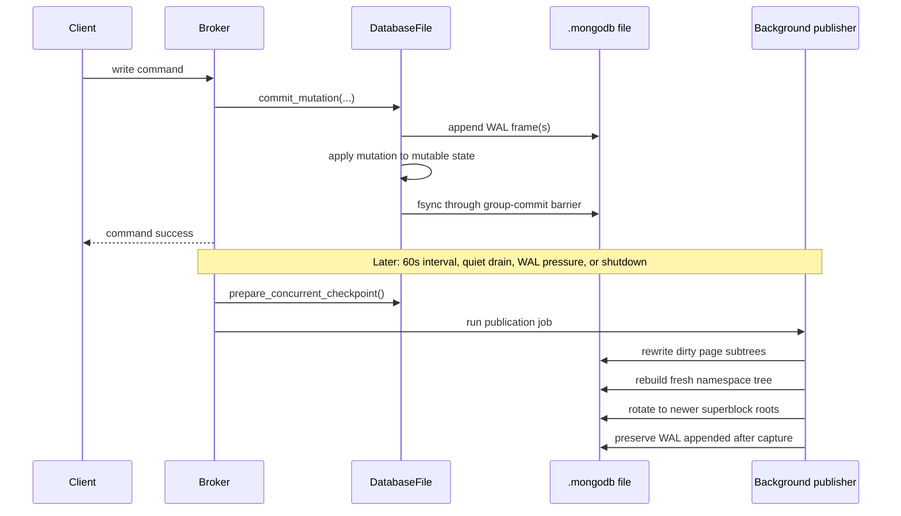

# ARCHITECTURE.md

## Overview

`mqlite` is a broker-per-file MongoDB-compatible local engine.

- One broker process owns one `.mongodb` file at a time.
- Clients talk to the broker with MongoDB `OP_MSG` over local IPC only.
- The `.mongodb` file is the durable system of record.
- Sidecars such as manifests and socket or pipe endpoints are ephemeral.
- New files are always written as v2 storage files. Pre-v2 files are rejected.

`ARCHITECTURE.md` describes the runtime, storage, planner, and durability model. The exhaustive
supported and unsupported command, query, and aggregation surface lives under `capabilities/` and
is enforced separately by tests.

## Workspace Layout

The workspace is split into focused crates:

- `mqlite-bson`: BSON ordering, dotted-path helpers, hashing, and `_id` generation support
- `mqlite-wire`: `OP_MSG` framing and parsing
- `mqlite-ipc`: manifest discovery plus Unix socket or Windows named-pipe transport
- `mqlite-catalog`: in-memory databases, collections, records, and index metadata used by the
  mutable runtime
- `mqlite-storage`: v2 file format, WAL, recovery, checkpoints, page codecs, pager, and metadata
  readers
- `mqlite-query`: filter parsing, projection, updates, expression evaluation, and aggregation
  semantics
- `mqlite-exec`: cursor batching and cursor lifecycle
- `mqlite-server`: broker lifecycle, command dispatch, planning, execution, and group commit
- `mqlite`: CLI entrypoints such as `serve`, `command`, `info`, `inspect`, `verify`, `checkpoint`,
  and `bench`

## Runtime Model

The broker is the only writer for a database file.

- Clients discover or spawn the broker through the manifest flow.
- The manifest is the readiness signal for attach-or-spawn callers.
- The broker can start listening before the mutable storage engine is opened.
- Reads on clean checkpointed files can use page-backed v2 read handles directly from disk.
- Writes, dirty-file recovery, and full validation still use the mutable `DatabaseFile` runtime,
  which hydrates a `Catalog` plus persisted change events and plan-cache entries.

This means the current runtime is intentionally hybrid:

- Fast path: clean checkpointed metadata and indexed reads can stay page-backed.
- Fallback path: writes or pending WAL require opening the mutable engine and replaying the WAL
  tail.

### Broker Behavior

- The broker tracks active connections and active commands separately.
- A shared WAL sync barrier lets multiple acknowledged writes ride the same `fsync`.
- Auto-spawned brokers can watch a parent pid and exit once that parent is gone and all IPC
  connections have drained.
- The broker can serve `find`, `explain`, `count`, and `distinct` from page-backed read views when
  the file is clean.
- Persisted plan-cache entries are loaded lazily, not during broker startup.

## Durable File Format

The durable store is a single v2 file. The current format version is `9`.

- File magic: `MQLTHD09`
- Superblock magic: `MQLTSB09`
- Page magic: `MQLTPG09`
- Fixed page size: `8192` bytes
- Fixed header length: `4096` bytes
- Two rotating superblocks

The file is self-describing:

- The header stores magic, file format version, page size, layout constants, and file id.
- Each superblock stores generation, durable LSN, last checkpoint time, WAL offsets, root page
  ids, and summary counters.
- The published page graph stores the latest checkpointed namespace, collection, index, stats,
  change-event, and plan-cache state.
- The WAL tail stores durable mutations written after the active published roots.

### Page Types

The active v2 storage engine centers on these page kinds:

- namespace internal and leaf pages keyed by namespace or index-name strings
- collection-meta and index-meta pages with page roots, key patterns, and counters
- stats pages with persisted per-index value frequencies and field-presence counts
- record internal and leaf pages keyed by stable `RecordId`
- secondary-index internal and leaf pages keyed by normalized comparable key bytes plus
  `RecordId`
- change-event internal and leaf pages
- plan-cache pages

The page-kind enum also reserves freelist and overflow slots, but the current runtime is built
around the page types listed above.

## Read Paths

### Metadata Commands

`mqlite info` and `mqlite inspect` are metadata-first commands.

- On clean files they answer from the header, active superblock, namespace tree, and meta pages.
- They do not hydrate all records or indexes.
- If the file still has a WAL tail, they fold in WAL metadata with a metadata-only pass rather than
  reopening the full mutable engine.

`mqlite verify` is intentionally slower. It opens the mutable engine, loads the persisted state,
replays the WAL tail, and validates the result.

### Page-Backed Read Fast Path

The page-backed read path is designed for clean checkpointed files:

- broker startup reads only lightweight startup metadata
- the broker opens a `PagerCollectionReadView` lazily on the first clean read
- namespace resolution comes from the persisted namespace tree
- `_id` lookups can route directly through the persisted `_id_` secondary tree
- `find`, `count`, `distinct`, and `explain` can read collection and index state without opening
  the mutable engine

The current page-backed path is read-only. As soon as a command needs write access or the file has
pending WAL, the broker opens the mutable engine instead.

### Pager

The v2 pager is a shared read-side component:

- offset-based reads use `read_at` or `seek_read`, not a shared mutable file cursor
- pages are cached in-process with an LRU-like bounded page cache
- cached pages are checksum-validated once when they enter the cache
- repeated reads of the same page reuse the cached bytes
- the pager exposes the active superblock, file size, and WAL length without full recovery

## Mutable Runtime And WAL

`DatabaseFile` is still the write-time runtime.

- It owns the file lock.
- It keeps an in-memory `Catalog`, change-event log, and persisted plan-cache state.
- It validates write plans and unique-index constraints before mutating the live state.
- It applies committed WAL mutations to the in-memory state immediately after append succeeds.
- Command success waits for the WAL sync barrier, not just the append.

Current WAL behavior:

- CRUD writes append typed insert, update, delete, and DDL mutations.
- Collection change events are appended atomically with the collection mutation that caused them.
- WAL records carry sequence numbers and checksums.
- Recovery replays WAL records with sequence numbers greater than the active superblock durable
  sequence.
- Truncated WAL tails are detected and ignored when the preceding frames are valid.

## Checkpoints And Published Page-Root Snapshots

There are two checkpoint-style write paths today.

### Foreground Full Checkpoint

The foreground checkpoint path writes the current in-memory state back into a fresh page graph and
rotates the active superblock.

- It is used for explicit checkpoint requests and final broker shutdown cleanup.
- It rewrites the full checkpoint state, not just the dirty parts.

### Background Published Snapshot

The background publication path exists to reduce restart cost and WAL replay cost without blocking
normal command handling for the full checkpoint duration.

- The broker captures a durable in-memory state under the storage lock.
- A background worker writes only the dirty collection and index subtrees.
- Fresh namespace metadata is always rewritten.
- Clean collection meta pages from the previous published roots are reused.
- Change-event pages and plan-cache pages are reused unless those areas were dirty.
- The superblock is rotated to the newer roots after the page graph is safely written.
- WAL appended after the capture is preserved after the new published roots.

This is the main current startup optimization for dirty workloads: reopen only has to replay the
WAL written after the latest published roots, not the full tail since the last foreground
checkpoint.

### Checkpoint Triggers

The broker can checkpoint or publish on:

- the periodic checkpoint interval, currently about every 60 seconds
- a quiet period after the last client disconnects
- WAL backlog pressure while the broker is still loaded
- graceful shutdown

## Recovery

Recovery is bounded by the active superblock plus the WAL tail that follows it.

1. Read and validate the file header.
2. Read both superblocks and choose the newest valid generation.
3. Open the page graph rooted by that superblock.
4. If the mutable engine is required, materialize the persisted catalog, change events, and plan
   cache entries from the page graph.
5. Replay WAL records newer than the superblock durable sequence.
6. Rebuild transient validation state and dirty-namespace tracking from the recovered state.

Important recovery invariants:

- reopen validates persisted index pages against collection pages
- recovery never silently rebuilds indexes from a collection scan
- if the newest superblock is corrupt, recovery can fall back to the older valid superblock

## Record And Index Storage

### Records

Collections are persisted as slotted record pages keyed by stable `RecordId`.

- each record keeps a stable `RecordId`
- record pages store raw BSON bytes
- inserts allocate the next `RecordId`
- updates preserve `RecordId`
- deletes remove the record and all matching index entries

### Secondary Indexes

Indexes are stored separately from records and persist their ordering on disk.

The current v2 secondary format uses:

- normalized comparable key bytes for navigation and bound checks
- prefix-compressed separator keys in internal pages
- prefix-compressed keys in leaf pages
- duplicate-key posting lists in leaf pages for repeated non-unique keys
- `RecordId` tie-breaking
- persisted field-presence masks so covered reads can distinguish explicit `null` from missing

Tree navigation is page-native:

- internal node routing uses binary search
- exact `_id` lookups can route directly to the first matching posting
- range scans walk leaf chains in key order

### Index Statistics

Each persisted index can also keep stats pages with:

- entry counts
- per-field presence counts
- per-field value-frequency summaries

These stats are used by the planner after reopen instead of rebuilding histogram-like data from
index scans.

## Planner And Plan Cache

`find` planning is local and cost-aware.

Candidate ranking considers:

- histogram-style value frequencies from persisted index stats
- interval cardinality estimates from index bounds
- expected keys examined
- expected docs examined
- sort work
- coverage of filter and projection paths

Current plan shapes:

- `COLLSCAN`
- `IXSCAN`
- branch-union `OR`

Important planner behavior:

- compound-prefix and sort-aware planning follow persisted index key order
- descending key parts are preserved across checkpoint and reopen
- covered execution preserves explicit `null` versus missing semantics through persisted
  presence-mask metadata
- disjunctions can prefer branch-local plans on different indexes instead of collapsing to a
  collection scan

The broker also maintains a sequence-keyed persisted plan cache.

- cache keys include namespace, filter shape, sort shape, and projection shape
- plan-cache entries are persisted in checkpoint state
- the broker loads persisted plan-cache entries lazily
- cached choices are reused only when they still match the visible collection sequence

## Aggregation And Cross-Namespace Resolution

Aggregation execution is split between pure document transforms and broker-backed namespace
resolution.

- `run_pipeline()` executes stages over an in-memory document stream
- `run_pipeline_with_resolver()` adds same-file namespace resolution
- cross-namespace stages resolve foreign collections from the same broker-owned `.mongodb` file

The current architecture explicitly supports these broker-backed aggregation families:

- `$lookup` against same-file collections, including correlated subpipelines
- `$unionWith` against same-file collections or collectionless `$documents` subpipelines
- `$changeStream` over the persisted local change-event log
- `$setWindowFields` as a local in-memory execution path
- terminal write stages such as `$out` and `$merge` against same-file targets

`$changeStream` is backed by persisted history visible when the aggregate starts. It is not yet a
live `awaitData` stream.

For the exact supported stage and expression surface, use the generated capability snapshots under
`capabilities/`.

## Command Execution Flow

The broker command path is:

1. The client or CLI opens a local IPC stream.
2. The broker reads an `OP_MSG`.
3. `mqlite-wire` materializes the body and document sequences.
4. `mqlite-server` rejects unsupported envelope features such as sessions or read concern.
5. The command dispatcher selects a handler by command name.
6. Read commands either:
   - use a clean page-backed read view, or
   - open the mutable storage engine and read from the recovered `Catalog`
7. Write commands append a WAL mutation, apply it to the mutable runtime, wait for durability, and
   then reply.
8. Cursor-producing commands hand their results to `mqlite-exec`.
9. The broker writes the reply back as `OP_MSG`.

When `mqlite command --debug` is used, the direct CLI path also emits a separate debug report on
stderr. That report combines:

- client-side IPC and wire timings
- broker-side server, query, storage, catalog, exec, and BSON spans
- counters such as page-cache hits and misses, page bytes read, and WAL replay counts
- lightweight process snapshots for the client and broker processes

## CLI And Validation Paths

The CLI surfaces split along intent:

- `mqlite command`: direct broker protocol validation path
- `mqlite command --debug`: same command path plus a structured diagnostics report on stderr
- `mqlite info`: metadata-focused summary of catalog size, counts, and last checkpoint state
- `mqlite inspect`: lower-level file, superblock, WAL, and page-graph metadata
- `mqlite verify`: slower full reopen and validation path
- `mqlite checkpoint`: force a foreground checkpoint
- `mqlite bench`: measure broker startup and simple query latency budgets

`mqlite command` remains the default direct validation path before any driver patching work.

## Out Of Scope

These remain intentionally out of scope for the current design:

- distributed topology features such as replication and sharding
- sessions and multi-document transactions
- TCP networking, TLS, auth, and wire compression
- server-side JavaScript such as `$where` and `$function`
- cross-file federation
- silently rebuilding persisted index state from collection data during reopen
- live awaitable change streams
